# CampusPilot 当前前后端框架实现总结

# 1. 当前前后端整体实现情况

当前 CampusPilot 已经完成一版可运行、可演示的前后端基础框架。

整体结构如下：

```Plain Text
campuspilot-home
→ 前端静态页面
→ 负责首页、登录注册、多角色工作台、驾驶舱、业务页面和 Agent 交互展示

campuspilot-server
→ Java 后端服务
→ 负责静态资源托管、业务接口、风险预警闭环、日志数据和 Agent API 代理入口
```

这套结构的作用是：本地前后端先把比赛演示链路跑通，金蝶平台侧再承载低代码业务对象、Agent、知识库和 OpenAPI 接入能力。

一个简单例子：

```Plain Text
学生张明远出现课程低分、出勤下降
→ 前端展示学生画像和风险分数
→ Java 后端返回风险预警单数据
→ 辅导员确认预警
→ 导师填写帮扶计划
→ 学生提交反馈
→ 最后复评结案
```

这个例子对应比赛里“学生成长画像 + 学业风险预警 + Agent 辅助分析 + 业务闭环”的核心展示线。

---

# 2. 当前前端框架已完成内容

## 2.1 前端基础框架已完成

当前前端位于：

```Plain Text
campuspilot-home/
```

主要文件包括：

```Plain Text
index.html
login.html
styles.css
app.js
auth.js
assets/
previews/
```

当前前端采用原生 HTML、CSS、JavaScript 实现，没有引入复杂前端框架。这样做的好处是部署简单，上传到服务器后由 Java 后端直接托管即可。

当前公共入口已经调整为：

```Plain Text
默认访问 index.html 时进入公共首页
→ 公共首页展示平台能力、业务流程和核心模块入口
→ 点击登录或注册后进入账号页
→ 登录后再按角色进入对应工作台
```

前端已经完成：

```Plain Text
1. 公共首页
2. 登录注册页面
3. 学生端工作台
4. 导师端工作台
5. 辅导员端工作台
6. 学院管理端工作台
7. 学业风险驾驶舱
8. 学生画像页面
9. 课程成绩页面
10. 学习行为页面
11. 风险预警单页面
12. Agent 助手页面
13. 风险处理闭环页面
14. 个人中心页面
15. 系统接入设置页面
```

---

## 2.2 前端角色权限展示已完成

前端已经支持不同角色进入不同工作台：

```Plain Text
学生：查看自己的成长画像、课程短板、AI 学习建议和反馈入口
辅导员：查看风险学生、确认预警单、跟踪处理状态
导师：查看课程短板、填写帮扶计划、推进学生成长建议
学院管理者：查看驾驶舱、风险分布、结案情况和系统配置
```

前端在 `app.js` 中通过角色权限配置控制可见页面、可操作动作和数据范围。

这样答辩时可以说明：系统不是所有用户都看同一张表，而是按校园业务角色划分工作台。

---

## 2.3 前端业务页面展示截图

### 公共首页

公共首页用于展示 CampusPilot 的默认产品入口、平台能力、业务流程和核心模块入口。

本轮已经进一步优化：

```Plain Text
1. 默认访问时直接显示公共首页
2. 文案改为正式产品表述，不再使用“预留接口”这类演示型说法
3. 布局按页面边界留白展开，而不是把内容全部压在中间
4. 大屏下标题和说明文字会适度放大，保证展示层级更自然
5. 点击登录/注册进入账号页时，增加了页面过渡动画
```

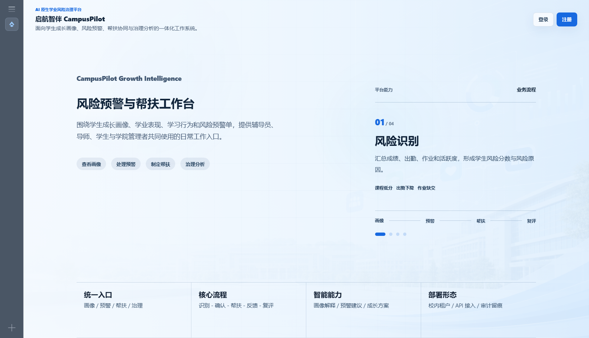

### 登录注册页面

登录页用于让学生、辅导员、导师、学院管理者按角色进入系统。

当前登录页已经与公共首页做了统一优化：

```Plain Text
1. 登录页内容按页面边界分布，避免界面过度聚集在正中间
2. 左侧角色轮播用于说明各角色的真实功能，而不是只做装饰
3. 右侧表单保留清晰账号入口，适合作为正式产品登录页展示
4. 大屏下标题、轮播文案和表单区字号会同步调整
```

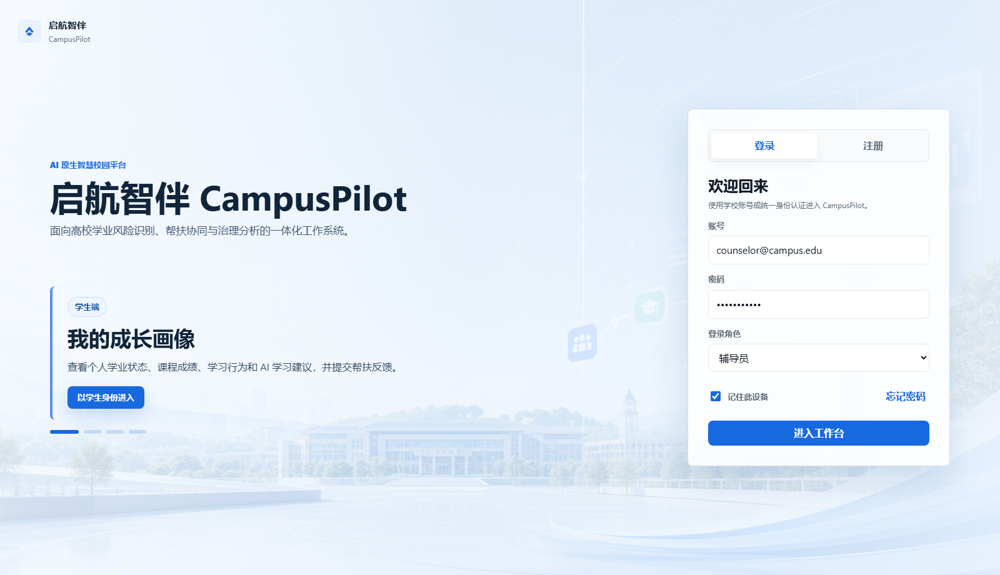

### 学生端工作台

学生端聚焦自己的成长画像、课程短板和反馈入口。

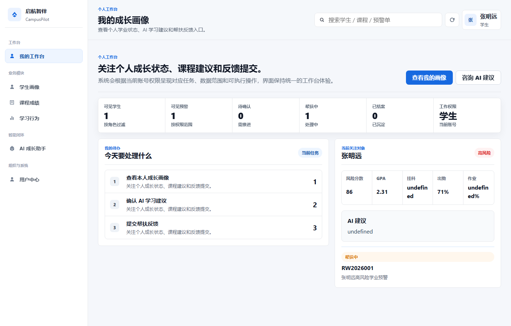

### 导师端工作台

导师端聚焦课程短板、帮扶计划和学生成长建议。

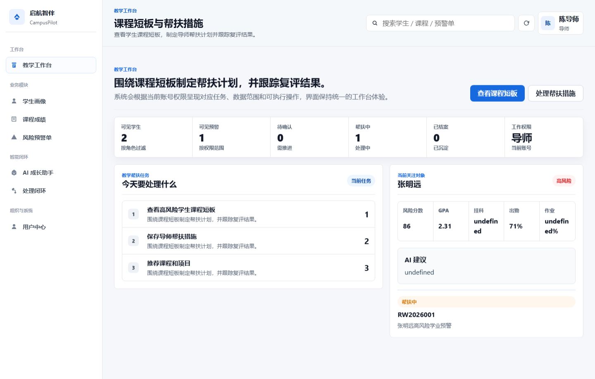

### 辅导员端工作台

辅导员端聚焦风险学生、预警确认和处理跟进。

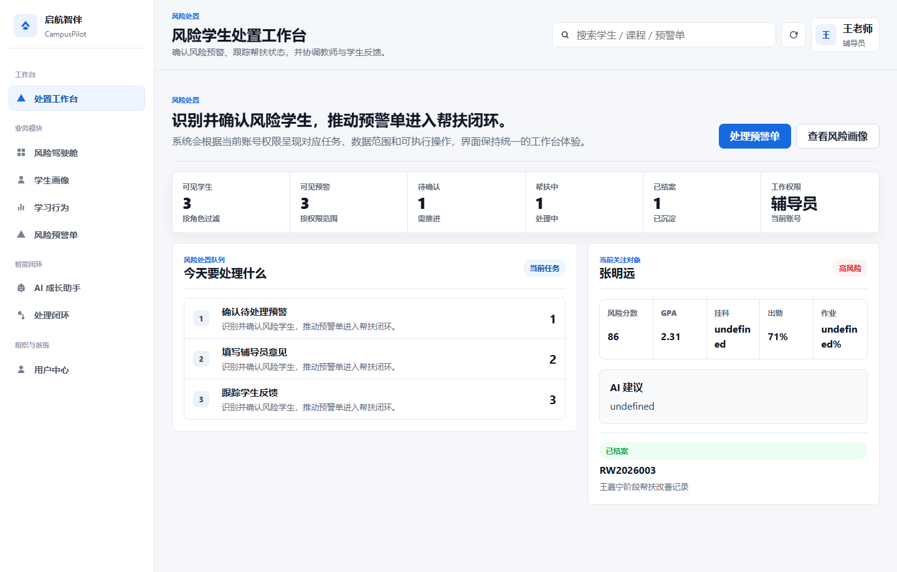

### 学院管理端工作台

管理端聚焦全院风险概览、处理状态和治理分析。

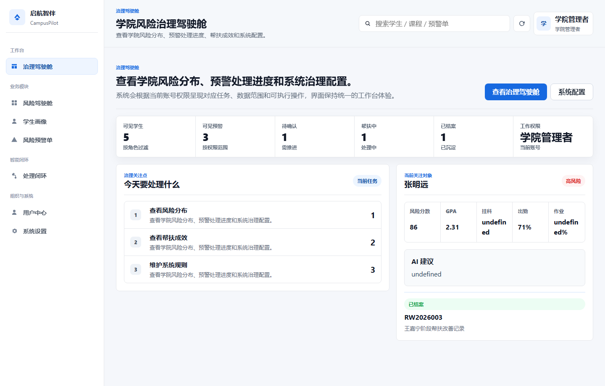

### 学业风险驾驶舱

驾驶舱展示学生总数、高风险人数、待确认预警、帮扶中和结案情况。

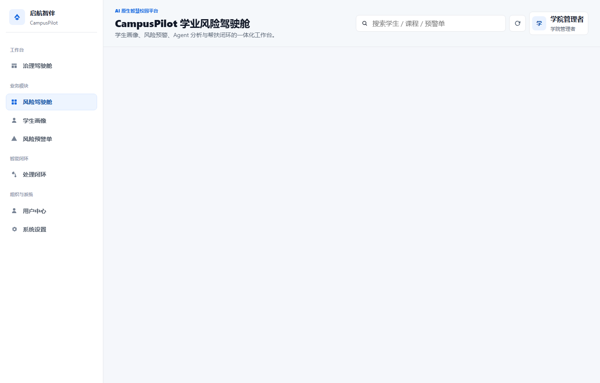

### 学生画像页面

学生画像页面展示基础信息、GPA、出勤率、作业完成率、风险原因和 AI 建议。

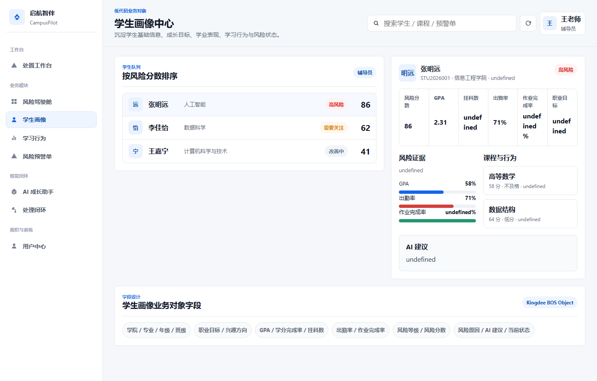

### 课程成绩页面

课程成绩页面用于展示学生课程短板和补强建议。

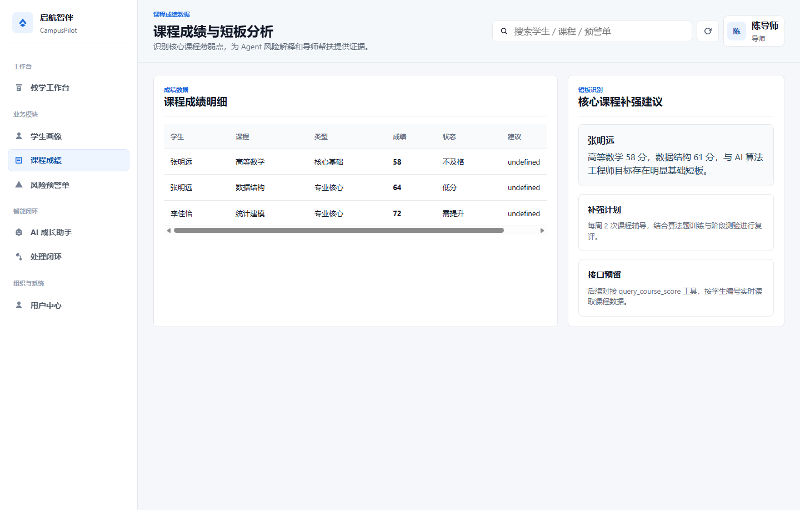

### 学习行为页面

学习行为页面展示出勤率、作业完成率、平台活跃度和行为风险说明。

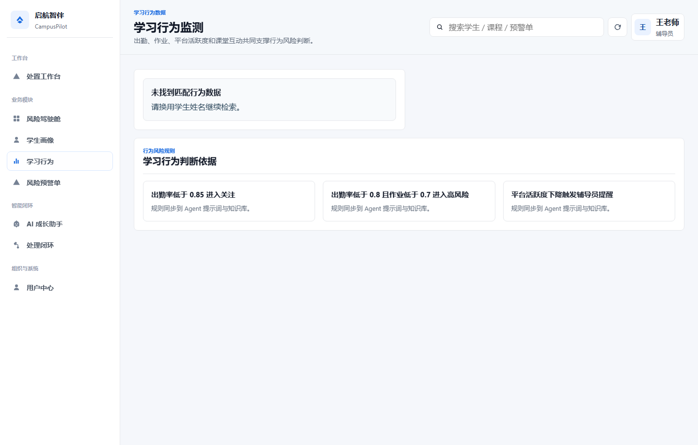

### 风险预警单页面

风险预警单页面承载预警信息、辅导员意见、导师帮扶、学生反馈和复评结案。

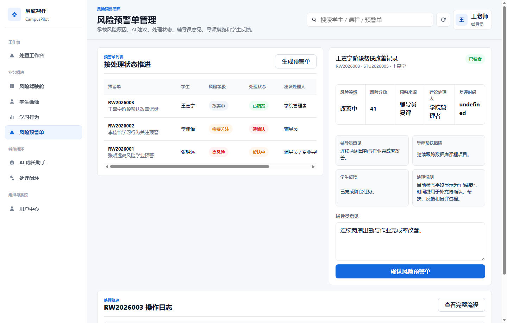

### Agent 助手页面

Agent 页面展示学业风险问答、工具调用规划和金蝶 Agent API 代理入口。

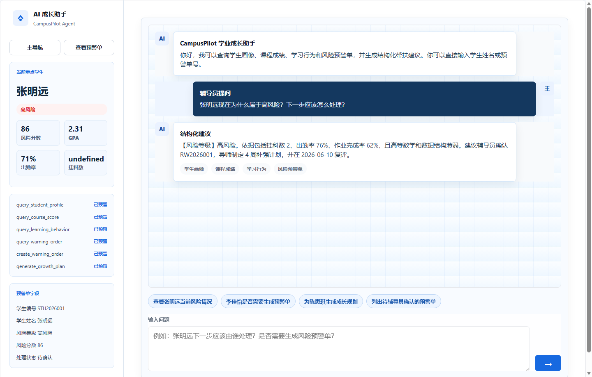

### 风险处理闭环页面

闭环页面展示从风险识别到预警生成、辅导员确认、导师帮扶、学生反馈、复评结案的全过程。

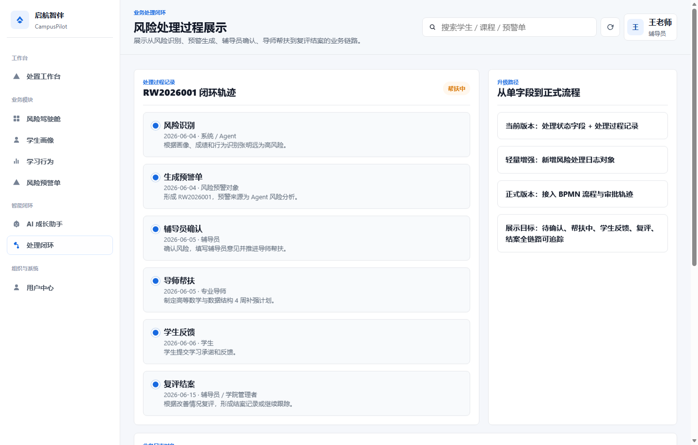

### 个人中心页面

个人中心展示当前账号、角色权限、可访问模块和操作日志。

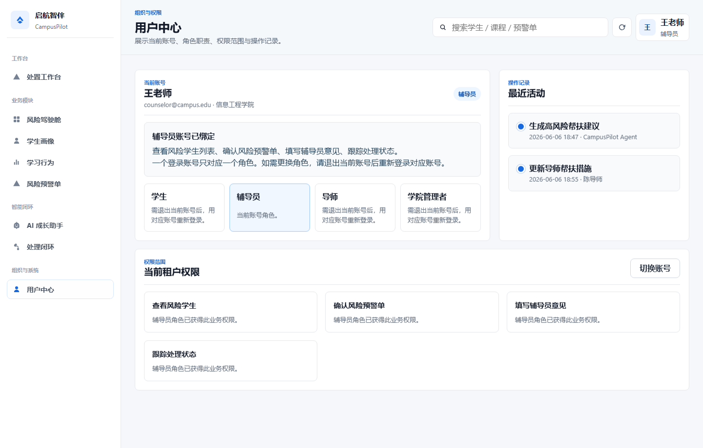

### 系统接入设置页面

系统设置页面展示金蝶环境地址、业务对象编码、Agent API 和第三方应用接入信息。

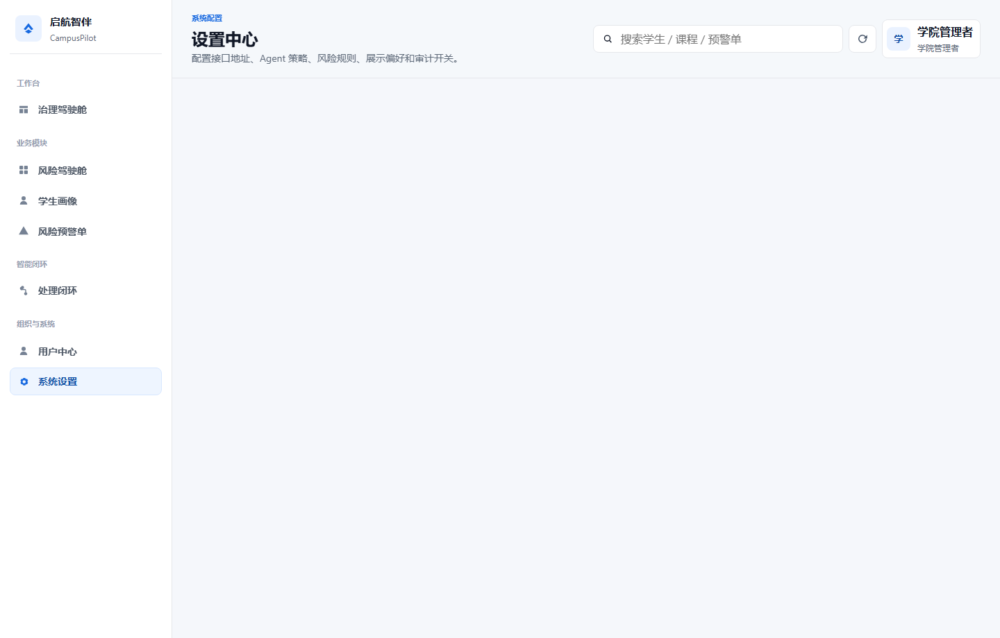

---

# 3. 当前后端框架已完成内容

## 3.1 Java 后端工程结构已完成

当前正式后端位于：

```Plain Text
campuspilot-server/
```

主要结构如下：

```Plain Text
src/main/java/com/campuspilot/
→ CampusPilotApplication.java
→ config/AppConfig.java
→ http/ApiHandler.java
→ http/StaticFileHandler.java
→ service/AgentClient.java
→ store/InMemoryCampusPilotStore.java
→ util/Json.java
→ util/RequestUtil.java
```

这不是临时脚本，而是按后端职责拆分成：

```Plain Text
入口启动
配置读取
HTTP 路由
静态资源托管
业务数据仓储
Agent API 调用
JSON 工具
请求工具
```

---

## 3.2 后端业务接口已完成

当前 Java 后端已经覆盖：

```Plain Text
1. 健康检查
2. 登录与注册
3. 学生画像数据
4. 课程成绩数据
5. 学习行为数据
6. 风险预警单数据
7. 风险分布和驾驶舱数据
8. 风险趋势数据
9. 帮扶成效数据
10. 风险处理日志
11. 生成预警单
12. 辅导员确认预警
13. 导师保存帮扶计划
14. 学生提交反馈
15. 复评结案
16. Agent 问答代理入口
17. 金蝶接入状态展示
```

主要接口统一放在：

```Plain Text
/api/campuspilot/...
```

例如：

```Plain Text
GET  /api/campuspilot/health
GET  /api/campuspilot/students
GET  /api/campuspilot/warnings
POST /api/campuspilot/warnings/suggest
POST /api/campuspilot/warnings/{code}/confirm
POST /api/campuspilot/warnings/{code}/mentor-plan
POST /api/campuspilot/warnings/{code}/feedback
POST /api/campuspilot/warnings/{code}/close
POST /api/campuspilot/agent/chat
```

---

## 3.3 后端演示闭环已完成

后端当前已经可以支撑一条完整演示闭环：

```Plain Text
风险识别
→ 生成预警单
→ 辅导员确认
→ 导师制定帮扶计划
→ 学生提交反馈
→ 复评结案
→ 形成日志和成效数据
```

这条闭环的意义是：它能证明 CampusPilot 不是单纯展示 AI 回答，而是把 AI 建议放进了真实校园业务流程。

---

# 4. 当前前后端联动方式

当前前端通过 `fetch` 调用 Java 后端接口。

联动方式如下：

```Plain Text
前端页面
→ 调用 /api/campuspilot/...
→ Java 后端 ApiHandler 处理请求
→ InMemoryCampusPilotStore 返回业务数据
→ 前端渲染驾驶舱、画像、预警单和流程日志
```

Agent 问答的联动方式如下：

```Plain Text
前端 Agent 页面
→ POST /api/campuspilot/agent/chat
→ Java 后端 AgentClient
→ 如果配置真实 Agent API，则转发到金蝶 Agent
→ 如果未配置，则返回本地兜底回答
```

这样本地演示不会因为真实 Agent API 暂时未接入而中断。

从页面入口角度看，当前联动顺序也已经固定为：

```Plain Text
默认访问 index.html
→ 展示公共首页
→ 点击登录/注册进入账号页
→ 账号页提交登录信息
→ 写入本地登录态
→ Java 后端继续提供对应角色工作台的数据接口
```

---

# 5. 后续可以优化的地方

## 5.1 前端展示优化

后续可以继续优化：

```Plain Text
1. 增强驾驶舱图表效果，例如风险趋势折线图、预警状态环形图
2. 继续优化移动端适配，保证手机或平板演示时页面不拥挤
3. 增加列表筛选和详情弹窗，让预警单处理更像真实业务系统
4. 增加操作成功后的动态反馈，例如确认、保存、结案后的状态变化
5. 为公共首页和登录页补充更完整的品牌化动画与状态反馈
```

## 5.2 后端能力优化

后续可以继续优化：

```Plain Text
1. 把内存数据仓储替换为 PostgreSQL/JDBC
2. 增加真实用户登录鉴权，例如 token、角色权限校验
3. 增加接口异常日志，便于云主机排查问题
4. 增加分页、筛选、排序，提升大数据量下的展示能力
5. 把风险规则配置化，例如 GPA、出勤率、挂科数阈值可调整
```

## 5.3 Agent 能力优化

后续可以继续优化：

```Plain Text
1. 接入真实金蝶 Agent API
2. 让 Agent 查询学生画像、课程成绩、学习行为和预警单对象
3. 让 Agent 输出结构化 JSON，方便前端直接生成预警建议
4. 增加知识库引用，让回答能说明依据来自哪份制度或规则
5. 增加工具调用，例如 create_warning_order、generate_growth_plan
```

---

# 6. 后续怎么接入金蝶平台

## 6.1 平台侧需要准备的内容

金蝶平台侧建议准备：

```Plain Text
1. 学生画像业务对象
2. 课程成绩业务对象
3. 学习行为业务对象
4. 风险预警单业务对象
5. 风险处理日志业务对象
6. CampusPilot Agent
7. 校园政策、培养方案、预警规则知识库
8. 第三方应用授权和 OpenAPI 调用权限
```

## 6.2 本地后端接入平台的方式

当前后端已经预留环境变量：

```Plain Text
CAMPUSPILOT_AGENT_API_URL
CAMPUSPILOT_AGENT_API_KEY
CAMPUSPILOT_AGENT_TIMEOUT_MS
```

接入真实 Agent 时，只需要在云主机或 PowerShell 配置：

```powershell
$env:CAMPUSPILOT_AGENT_API_URL="https://你的金蝶Agent接口地址"
$env:CAMPUSPILOT_AGENT_API_KEY="你的接口密钥"
```

然后启动 Java 后端：

```powershell
cd C:\Users\xbai55\Documents\contest\campuspilot-server
.\scripts\run.ps1
```

此时前端 Agent 页面仍然调用：

```Plain Text
POST /api/campuspilot/agent/chat
```

但实际回答会由 Java 后端转发到金蝶 Agent。

## 6.3 云主机部署接入方式

云主机上建议把两个目录上传到同一级：

```Plain Text
/opt/campuspilot/campuspilot-home
/opt/campuspilot/campuspilot-server
```

运行时配置：

```bash
export CAMPUSPILOT_HOST=0.0.0.0
export CAMPUSPILOT_PORT=8787
export CAMPUSPILOT_STATIC_ROOT=/opt/campuspilot/campuspilot-home
export CAMPUSPILOT_AGENT_API_URL="https://你的金蝶Agent接口地址"
export CAMPUSPILOT_AGENT_API_KEY="你的接口密钥"
```

访问地址：

```Plain Text
http://云主机IP:8787/index.html#dashboard
```

## 6.4 数据对象接入方式

后续如果要让 Java 后端真正读取金蝶平台业务对象，可以按下面步骤做：

```Plain Text
1. 在金蝶平台确认业务对象编码和字段编码
2. 申请第三方应用授权和 OpenAPI 权限
3. Java 后端新增 KingdeeOpenApiClient
4. 把 InMemoryCampusPilotStore 替换为 KingdeeCampusPilotStore
5. 保持前端接口路径不变
6. 前端继续调用 /api/campuspilot/students、/warnings 等接口
```

这样前端不用大改，只是后端数据来源从本地内存换成金蝶平台。

---

# 7. 当前总结

目前 CampusPilot 已经完成：

```Plain Text
1. 静态前端框架
2. 多角色工作台
3. 学生画像、课程、行为、预警单页面
4. 学业风险驾驶舱
5. Agent 助手展示页面
6. 风险处理闭环页面
7. Java 后端工程
8. 统一 /api/campuspilot 接口
9. 风险预警闭环接口
10. Agent API 代理入口
11. 云主机部署说明
12. 前端页面截图展示
```

当前版本已经具备比赛答辩所需的最小可演示系统基础。

后续重点是把“本地演示数据 + 本地兜底 Agent”升级为：

```Plain Text
金蝶业务对象真实数据
→ 金蝶 Agent 真实问答
→ OpenAPI 工具调用
→ 自动生成预警单
→ 自动推进帮扶闭环
```

这样项目就能更明确地体现“金蝶低代码平台 + AI Agent + 智慧校园业务闭环”的完整价值。
